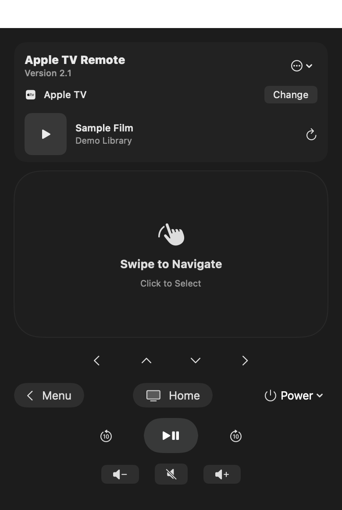

  

<h1 align="center">Apple TV Remote for macOS</h1>

<strong>Your Apple TV remote, one click from the Mac menu bar.</strong>

  Swipe, click, type, control playback, and switch devices without reaching for another remote.

  <a href="https://github.com/pmnowak/apple-tv-remote-macos/releases/latest"><strong>Download the latest release for Apple silicon</strong></a>
  ·
  <a href="https://github.com/pmnowak/apple-tv-remote-macos/releases/latest">Release notes</a>

  

## A remote that belongs on your Mac

Apple TV Remote is a compact SwiftUI menu-bar controller for Apple-silicon Macs. It discovers compatible devices on your local network, remembers paired Apple TVs in macOS Keychain, and keeps the controls close without occupying a full desktop window.

| Navigate naturally | Control playback | Stay in the flow |
| --- | --- | --- |
| Swipe on the touch surface or use directional buttons. | Play, pause, seek, mute, change volume, and control power. | Switch Apple TVs, see Now Playing, and send text when tvOS requests keyboard input. |

  

## Highlights

- Native SwiftUI menu-bar interface with macOS materials and system colors
- Bonjour discovery for Apple TVs and AirPlay speakers
- Swipe navigation, click/select, menu, home, directional controls, and 10-second seek
- Play/pause, power, mute, and volume controls where the active Apple TV route supports them
- Optional Now Playing metadata and artwork after separate AirPlay pairing
- Keyboard text entry when an editable field is focused on tvOS
- Credentials stored in macOS Keychain; no telemetry or cloud account

## Install

This release requires macOS 14 or later and an Apple-silicon Mac. The Mac and Apple TV must be on the same local network. Version 2.2 bundles its private [`pyatv`](https://pyatv.dev/) backend, so Python, pipx, and a separate pyatv installation are not required.

1. Download the latest arm64 DMG, open it, and drag **Apple TV Remote** to Applications.
2. Open the remote icon in the menu bar, choose an Apple TV, select **Pair Apple TV**, and enter the PIN shown on the television.

The current download is ad-hoc signed and not notarized. macOS may block the first launch; in Finder, Control-click the app, choose **Open**, then confirm. A physical Apple TV is required for pairing and end-to-end operation.

## Feature compatibility

| Capability | Support |
| --- | --- |
| Device discovery and switching | Yes |
| Companion PIN pairing | Yes |
| Swipe and directional navigation | Yes; gestures are sent when the swipe ends |
| Select, menu, home, play/pause, seek | Yes |
| Keyboard input | When tvOS has a text field focused |
| Now Playing | Requires separate AirPlay pairing; availability depends on tvOS/app metadata |
| Volume and power | Depends on the active audio route, network standby, and HDMI-CEC setup |
| Siri / voice control | No public third-party Remote Siri API is available |
| Continuous touch / pressure gestures | Not provided by the CLI-backed transport |

## How it works

The interface, discovery orchestration, Keychain integration, and process management are native macOS code. Apple does not publish a public macOS framework for third-party Apple TV remote commands, so the app bundles a pinned, arm64, one-folder helper built from the reverse-engineered Companion and AirPlay support in [`pyatv`](https://github.com/postlund/pyatv). The helper does not use a system Python installation or external `atvremote` executable at runtime.

Persistent credentials are stored in the login Keychain and each CLI invocation uses `--storage none`. Because credentials must be supplied to the CLI as process arguments, another process running as the same macOS user may be able to inspect them briefly. Diagnostic logs can contain device names, identifiers, addresses, discovery results, and playback/backend information; review logs before attaching them to a public issue. Logs are stored in `~/Library/Logs/Apple TV Remote/` and can be deleted when the app is closed.

## Disclaimer

This is an independent, unofficial project and is not affiliated with, endorsed by, or sponsored by Apple Inc. Apple, Apple TV, macOS, iPhone, iPad, and Siri are trademarks of Apple Inc. The screenshots use fictional media data and contain no personal device information.

No license is granted for this repository unless a license file is added. Third-party components remain subject to their own licenses.
